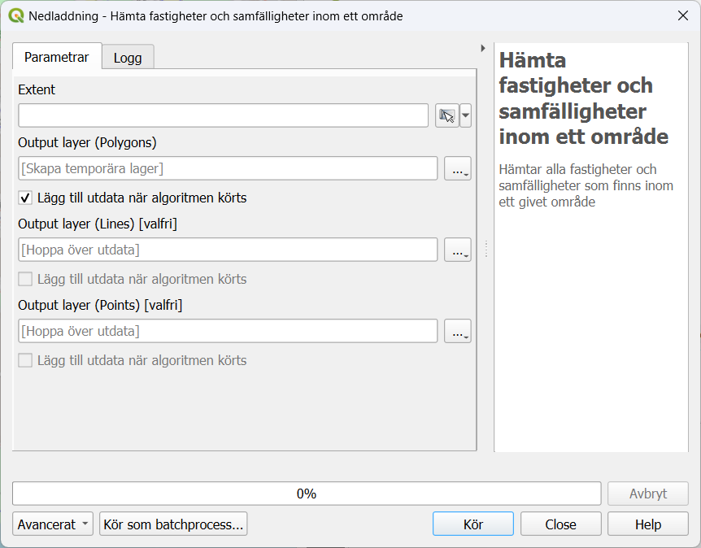

# Hämta fastigheter och samfälligheter inom ett givet område

## Krav på tjänster

Följande tjänster behöver konfigureras under [inställningar](../installningar.md):

* Registerbeteckning Direkt & Fastighet och Samfällighet Direkt _eller_
* Registerbeteckning Direkt & Fastighetsindelning Direkt _eller_
* Fastighetsindelning Direkt

!!! note "Begränsningar i tjänsten Fastighetsindelning Direkt"
    Tjänsten Fastighetsindelning Direkt är avgiftsfri, men innehåller i dagsläget ej 3D-fastigheter.
