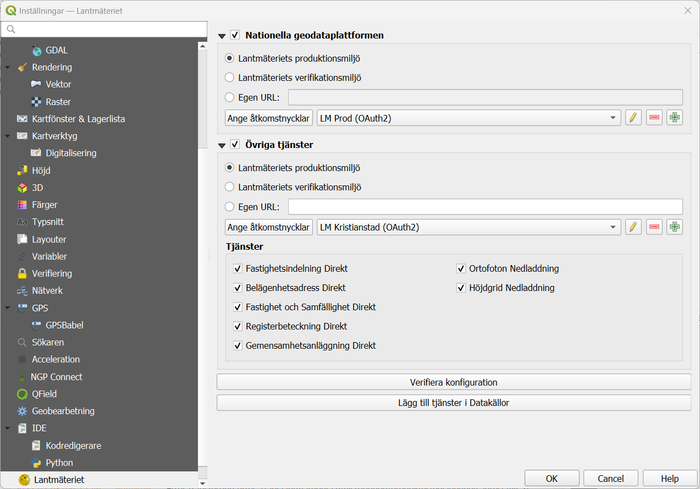
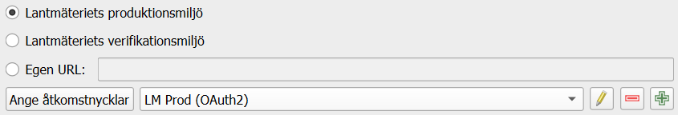
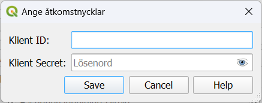

# Inställningar

Pluginets inställningar nås via [QGIS inställningsdialog](https://docs.qgis.org/latest/en/docs/user_manual/introduction/qgis_configuration.html#options), på sidan "Lantmäteriet".

## Översikt

Inställningarna består av tre sektioner:

* Nationella geodataplattformen (NGP)
* Övriga tjänster
* Kommandon (knappar)

## Inställningar för anslutning

För både NGP och övriga tjänster anges tjänstens bas-URL, antingen genom att välja någon av Lantmäteriets miljöer som
då använder de förkonfigurerade URL:erna, eller genom att ange en egen URL. Att ange en egen URL kan t.ex. vara aktuellt
om man har en proxy i sin organisation via vilken trafik till Lantmäteriets tjänster ska gå.

Dessutom anges den autentisering som ska användas. För Lantmäteriets miljöer behöver detta vara antingen OAuth 2
(standard för organisationer) eller Basic Auth (standard för privatpersoner). För intern proxy går det att välja valfri
autentiseringsmetod som QGIS stödjer, eller ingen autentisering alls.

### Val av övriga tjänster

För övriga tjänster behöver du dessutom välja vilka tjänster du har tillgång till. Valet här påverkar vilka funktioner
du kommer ha tillgängligt, och vilka tjänster som används när det finns flera alternativ.

### OAuth 2-inställningar

Då autentisering via OAuth 2 kräver en del konfiguration finns ett smidigt flöde som sköter denna konfiguration. Använd
knappen "Ange åtkomstnycklar" och ange i rutan som kommer upp dina åtkomstnycklar som du får från Lantmäteriets API-manager.

Pluginet skapar då upp en passande OAuth 2-konfiguration. Om du använder QGIS 3.44 eller senare används Client Credentials
flödet, vilket inte kräver användarnamn och lösenord. För versioner innan 3.44 används Authorization Code-flödet, som kommer
öppna en webbläsare där du får logga in med ditt Lantmäteriet-konto.

Det går även bra att använda en befintlig OAuth 2-konfiguration, t.ex. om du har en sådan i QGIS sedan tidigare.

## Kommandon

I inställningsdialogen finns även några knappar för att köra olika kommandon.

### Verifiering av konfigurationen

Den första knappen "Verifiera konfiguration" kontrollerar att den aktuella konfigurationen är korrekt.

### Lägg till tjänster i Datakällor

Med andra knappen, "Lägg till tjänster i Datakällor", kan du lägga till de tjänster som är konfigurerade i pluginet som
[datakällor](https://docs.qgis.org/latest/en/docs/user_manual/introduction/browser.html) i QGIS.
