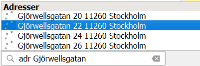
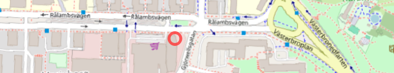
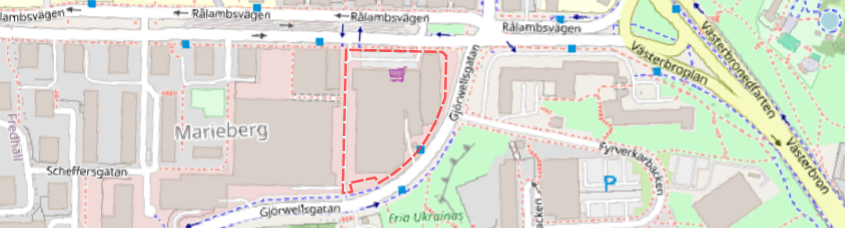
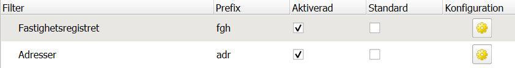

# Sökning

Pluginet möjliggör sökning på adresser samt beteckningar på fastigheter, samfälligheter och gemensamhetsanläggningar.
Sökfunktionen är integrerad i [QGIS inbyggda sökfält](https://docs.qgis.org/latest/en/docs/user_manual/introduction/qgis_gui.html#locator-bar).

## Användning

1. Aktivera sökrutan genom att klicka på den eller använd kortkommandot ++ctrl+k++ (eller ++cmd+k++ på Mac).
2. Skriv sedan in sökningstypens prefix (`adr` eller `fgh`) eller välj i listan med förslag.
3. Skriv därefter in sökordet (t.ex. adress eller registerbeteckning) och välj rätt sökresultat.
   

Du kommer då förflyttas till valt objekt, och objektet kommer markeras i kartan.

<figure markdown="span">
   
   <figcaption>Adressökning (Gjörwellsgatan 22) markerad i kartan</figcaption>
</figure>

<figure markdown="span">
   
   <figcaption>Fastighetssökning (Stockholm Trängkåren 6) markerad i kartan</figcaption>
</figure>

### Detaljer om möjliga söksträngar

Hur "förlåtande" sökningen är beror på vilken [tjänst](#krav-pa-konfigurerade-tjanster) hos Lantmäteriet som används, men som regel kräver
sökningen att beteckningen är korrekt skriven, men behöver inte vara fullständig. T.ex. ger både "Trängkåren 6"
och "Trängkår 6" träff på fastigheten "Stockholm Trängkåren 6", men "Trägnkåren 6" ger ingen träff.

Sökningar är inte skiftlägeskänslig, så "Trängkåren 6" och "trängkåren 6" ger samma resultat.

Många adresser och fastighetsbeteckningar förekommer i flera kommuner i landet (och vissa adresser även flera
gånger inom samma kommun), du kan därför behöva ange kommunnamnet respektive postorten för att få träff på rätt objekt.

## Krav på konfigurerade tjänster

Följande tjänster behöver konfigureras under [inställningar](installningar.md) för respektive sökning:

| Sökning på | Tjänst                                                                                                                                                                          |
| ---------- |---------------------------------------------------------------------------------------------------------------------------------------------------------------------------------|
| Adresser   | Belägenhetsadress Direkt                                                                                                                                                        |
| Fastigheter och Samfälligheter | Registerbeteckning Direkt & Fastighet och Samfällighet Direkt _eller_ Registerbeteckning Direkt & Fastighetsindelning Direkt _eller_ Fastighetsindelning Direkt |
| Gemensamhetsanläggningar | Registerbeteckning Direkt & Gemensamhetsanläggning Direkt                                                                                                                       |

## Sökinställningar

Du kan justera hur sökningen fungerar genom att justera [sökfältets inställningar](https://docs.qgis.org/latest/en/docs/user_manual/introduction/qgis_configuration.html#locator-settings) (på svenska heter fliken "Sökaren").

I inställningsrutan visas en rad för varje sökningstyp (gemensamhetsanläggningar ingår i samma som fastigheter och samfälligheter).
För varje rad finns tre kolumner:

* **Prefix** - Vad som ska skrivas först i sökfältet för att kunna söka på respektive objekttyp (normalt `adr` för adresser, `fgh` för fastigheter)
* **Aktiverad** - Om sökning ska vara aktiverad för denna sökningstyp
* **Standard** - Om aktiverat behöver inte prefix skrivas för att sökning ska ske på objekttypen

